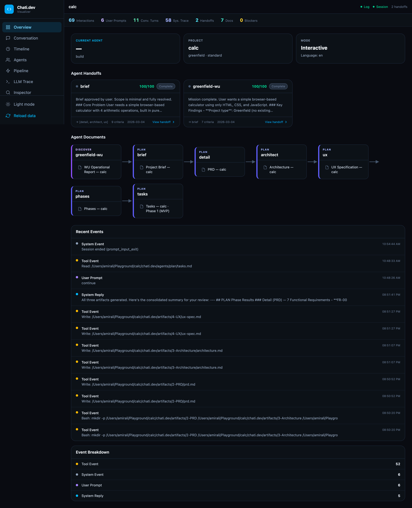

<div align="center">
<br>

<br><br>
<strong>AI-Powered Multi-Agent Orchestration System</strong><br>
<em>Structured vibe coding for Full Stack Development.</em>
</div>

<p align="center">
  <a href="https://www.npmjs.com/package/chati-dev"></a>
  <a href="LICENSE"></a>
  <a href="https://nodejs.org/"></a>
  <a href="#multi-cli-support"></a>
  <a href="#internationalization"></a>
  <a href="https://github.com/Chati-dev/Chati.dev/actions/workflows/ci.yml"></a>
  <a href=".github/CONTRIBUTING.md"></a>
</p>

---

## What is Chati.dev?

Chati.dev is a system that **turns AI into a structured development team**. Instead of chatting with a single AI that forgets everything between sessions, you get 13 specialized agents — each with a clear role — working together through a defined pipeline.

You describe what you want to build. The agents handle requirements, architecture, planning, coding, testing, and deployment — in order, with quality gates between each phase.

```
You → DISCOVER → PLAN → BUILD → DEPLOY → Done
       "what"   "how"  "code"   "ship"
```

Every decision is saved. Every artifact is validated. If you close your laptop and come back tomorrow, the system picks up exactly where you left off.

---

## Why Chati.dev?

### The Problem

AI-assisted development today has three critical issues:

1. **Context Loss** — AI forgets decisions across sessions, leading to inconsistent implementations
2. **Planning Gaps** — Jumping straight to code without structured requirements leads to rework
3. **Vendor Lock-in** — Most AI dev tools only work with one provider, limiting flexibility

### The Solution

Chati.dev introduces **Agent-Driven Development**: a pipeline where each agent owns a specific phase, produces validated artifacts, and hands off context to the next agent. The system ensures context is never lost, knowledge persists across sessions, and you can use any supported AI provider.

---

## Quick Start

### Prerequisites

- **Node.js** >= 20.0.0 ([download](https://nodejs.org/))
- **An AI CLI** — at least one of:
  - [Claude Code](https://docs.anthropic.com/en/docs/claude-code/overview) (recommended)
  - [Gemini CLI](https://github.com/google-gemini/gemini-cli)
  - [Codex CLI](https://github.com/openai/codex)

### 1. Install in your project

Open a terminal in your project directory:

```bash
npx chati-dev init
```

The wizard guides you through 4 steps:

| Step | What it asks |
|------|-------------|
| **Language** | English, Portuguese, Spanish, or French |
| **Project Type** | Greenfield (new) or Brownfield (existing) |
| **AI Provider** | Claude, Gemini, or Codex — auto-configures optimal models per agent |
| **Confirm** | Review summary and proceed |

### 2. Activate the orchestrator

Open your AI CLI in the same project directory, then type:

| CLI | Command | Notes |
|-----|---------|-------|
| **Claude Code** | `/chati` | Slash command (native) |
| **Gemini CLI** | `/chati` | TOML custom command |
| **Codex CLI** | `$chati` | Skill invocation (Codex uses `$` for skills, not `/`) |

The orchestrator loads your session, detects where you left off, and routes you to the right agent. You stay inside the system until you explicitly exit.

> **Codex CLI note:** You can also just describe what you want (e.g., "start chati" or "plan my project") and Codex will auto-invoke the skill based on its description.

### 3. Follow the pipeline

The agents guide you through each phase:

| Phase | What happens | You do |
|-------|-------------|--------|
| **DISCOVER** | Agents interview you about what you want to build | Answer questions about your project |
| **PLAN** | Agents create PRD, architecture, UX spec, phases, and tasks | Review and approve the plan |
| **BUILD** | Dev agent implements the code, task by task | Review code as it's built |
| **DEPLOY** | DevOps agent handles git, deployment, and documentation | Confirm deployment settings |

Quality gates run automatically between phases — if something doesn't meet the threshold, the system loops back and fixes it.

### Monitor progress

```bash
npx chati-dev status          # One-time snapshot
npx chati-dev status --watch  # Auto-refresh every 5s
```

### Visualizer

For a richer view of what's happening, launch the built-in web dashboard:

```bash
npx chati-dev visualize
```

This opens a local web app that reads your project's session state, interaction logs, agent handoffs, and generated artifact documents in real time. No data leaves your machine.



The dashboard has seven views accessible from the sidebar:

| View | What you see |
|------|-------------|
| **Overview** | Project state, agent handoff cards, and a pipeline timeline of generated documents |
| **Conversation** | The full user ↔ LLM dialogue with preserved formatting |
| **Timeline** | Every pipeline event in chronological order, filterable by kind, agent, and provider |
| **Agents** | Per-agent status board — completed, partial, observed, skipped, or not used in this pipeline |
| **Pipeline** | Visual flow of the active pipeline with per-node status indicators |
| **LLM Trace** | Raw internal prompts and LLM responses for debugging |
| **Inspector** | Click any event to view its full JSON payload |

### Exit & Resume

| CLI | Exit | Resume |
|-----|------|--------|
| **Claude Code** | `/chati exit` | `/chati` |
| **Gemini CLI** | `/chati exit` | `/chati` |
| **Codex CLI** | `$chati exit` | `$chati` |

The system saves your full session state — pipeline position, current agent, decisions, and context. You resume exactly where you left off, even across days or machines.

---

## Key Features

| Feature | What it means |
|---------|--------------|
| **13 Specialized Agents** | Each agent has a defined mission, success criteria, and handoff protocol — not one AI trying to do everything |
| **Multi-CLI Architecture** | Choose your AI provider at install time: Claude, Gemini, or Codex. Each agent gets the optimal model for that provider |
| **Quality Gates** | Every phase is validated before moving forward. 3-tier verdicts: APPROVED, NEEDS_REVISION, or BLOCKED |
| **Context Persistence** | Sessions survive restarts. Close your IDE, come back next week — the system remembers everything |
| **Session Lock** | Once activated, you stay inside the system. No accidentally "falling out" into generic AI mode |
| **Multi-Terminal** | Autonomous agents run in parallel in separate terminals. Detail, Architect, and UX agents work simultaneously |
| **Memory System** | The system learns from mistakes. Gotchas are captured automatically and recalled when relevant |
| **Execution Profiles** | Three profiles — explore (read-only), guided (default), autonomous (gate >= 95%) — with safety net and circuit breaker |
| **IDE-Agnostic** | Works with Claude Code, VS Code, Cursor, Gemini CLI, Codex CLI, and AntiGravity |
| **4 Languages** | Interface supports English, Portuguese, Spanish, and French. Artifacts are always generated in English |
| **Supply Chain Security** | Every file is cryptographically signed (Ed25519). Tampered packages are blocked on install |

---

## Multi-CLI Support

Chati.dev is provider-agnostic. You choose your AI provider during installation, and the system auto-configures optimal model assignments for every agent.

### Supported Providers

| Provider | CLI | Deep Reasoning | Lightweight | Status |
|----------|-----|---------------|-------------|--------|
| **Claude** | `claude` | Opus | Sonnet / Haiku | Default |
| **Gemini** | `gemini` | Pro | Flash | Full support |
| **Codex** | `codex` | Codex | Codex Mini | Full support |

### How Model Assignment Works

Each agent is classified by its reasoning needs:

- **Deep reasoning** (Architect, QA, Dev, Detail, Brownfield-WU) → top-tier model
- **Lightweight** (Brief, Phases, UX, Greenfield-WU, DevOps, Orchestrator) → fast model

When you select a provider, the system maps each agent to the best available model:

```
Claude:  architect → opus,   brief → sonnet,  greenfield-wu → haiku
Gemini:  architect → pro,    brief → flash,   greenfield-wu → flash
Codex:   architect → codex,  brief → codex-mini
```

### CLI Invocation Syntax

Each provider uses its own CLI syntax. Chati.dev handles this transparently:

| Provider | Command | Example |
|----------|---------|---------|
| Claude | `claude --print --model <id>` | `claude --print --model claude-opus-4-6` |
| Gemini | `gemini --model <id>` | `gemini --model gemini-2.5-pro` |
| Codex | `codex exec -m <id>` | `codex exec -m gpt-5.3-codex` |

Prompts are piped via stdin for all providers. You can override individual agent models in `chati.dev/config.yaml` under `agent_overrides`.

---

## Execution Profiles

Three profiles control how much autonomy agents have:

| Profile | Behavior | When to use |
|---------|----------|-------------|
| **explore** | Read-only. Agents analyze but don't modify files | Understanding a new codebase |
| **guided** | Default. Agents propose changes, you approve | Normal development workflow |
| **autonomous** | Agents execute without confirmation (quality gates >= 95%) | Trusted pipelines with high quality scores |

The system starts in `guided` mode. Transition to `autonomous` requires both QA gates scoring >= 95%. A safety net with 5 triggers (stuck loop, quality drop, scope creep, error cascade, user override) automatically reverts to guided mode when needed.

---

## Architecture

### 13 Agents, 4 Pipeline Phases

| Phase | Agents | What they do |
|-------|--------|-------------|
| **DISCOVER** | Greenfield WU, Brownfield WU, Brief | Interview you, understand your project, extract requirements |
| **PLAN** | Detail, Architect, UX, Phases, Tasks | Create PRD, design architecture, define UX, break work into phases and tasks |
| **BUILD** | Dev | Implement code task by task, following the plan |
| **DEPLOY** | DevOps | Handle git operations, deployment, and documentation |
| **Quality** | QA-Planning, QA-Implementation | Validate plan coherence (>= 95%) and code quality (>= 95%) between phases |

### How the Pipeline Works

```
 You activate the orchestrator (/chati or $chati)
       │
       ▼
 ┌──────────────────────────────────────────────┐
 │  ORCHESTRATOR                                │
 │  Routes you to the right agent.              │
 │  Manages session state and handoffs.         │
 └──────────────────────────────────────────────┘
       │
       ├─ In your conversation ─────────────────┐
       │                                        │
       │    DISCOVER (interactive)              │
       │    WU interviews you → Brief compiles  │
       │    requirements into a structured doc  │
       │                                        │
       ├─ Spawns separate terminals ────────────┐
       │   (using your selected AI provider)    │
       │                                        │
       │    PLAN (autonomous, parallel)         │
       │    Detail ───┐                         │
       │    Architect ├─ run simultaneously     │
       │    UX ───────┘                         │
       │    Then: Phases → Tasks                │
       │                                        │
       ├─ Quality Gate ─────────────────────────┐
       │                                        │
       │    QA-Planning validates the plan      │
       │    Must score >= 95% to proceed        │
       │                                        │
       ├─ Spawns terminal(s) ───────────────────┐
       │                                        │
       │    BUILD                               │
       │    Dev implements tasks (parallel      │
       │    when tasks are independent)         │
       │                                        │
       ├─ Quality Gate ─────────────────────────┐
       │                                        │
       │    QA-Implementation validates code    │
       │    Tests + static analysis + coverage  │
       │                                        │
       └─ Spawns terminal ──────────────────────┐
                                                │
            DEPLOY                              │
            DevOps handles git, deploy, docs    │
                                                │
                                         ✓ Done │
```

Each spawned terminal runs as a separate CLI process with its own context window, write-scope isolation, and structured handoff output. The AI provider and model are selected automatically based on your configuration.

### Intelligence Layer

Three systems operate transparently behind the pipeline:

| System | What it does |
|--------|-------------|
| **Context Engine (PRISM)** | Injects the right context at the right time. 5 layers of context (from system-wide rules down to specific task details). Tracks how much context space remains and adapts automatically. |
| **Memory System (RECALL)** | Remembers decisions, gotchas, and lessons across sessions. Organized into 4 sectors: what happened (episodic), what we know (semantic), how we do things (procedural), and what we learned (reflective). |
| **Decision Engine (COMPASS)** | Before creating something new, checks if a similar component already exists. Decides whether to reuse, adapt, or create from scratch. Keeps a registry of all project entities. |

### Constitution

The system is governed by a **19-article Constitution** that enforces agent behavior, quality standards, security, and system integrity:

- **Agent Governance** — Every agent has a defined mission, scope, and success criteria
- **Quality Standards** — Minimum 95% score on quality gates. 3-tier verdicts (APPROVED / NEEDS_REVISION / BLOCKED)
- **Security** — No secrets in system files. No destructive operations without confirmation. Ed25519 supply chain verification
- **Mode Governance** — Planning mode can't modify project code. Build mode has full access
- **Session Lock** — Once activated, all messages route through the orchestrator
- **Model Governance** — Each agent runs on its designated model, enforced by the CLI adapter
- **Execution Profiles** — Explore, guided, and autonomous modes with safety net and circuit breaker
- **Multi-CLI** — Provider-agnostic architecture with adapter pattern and automatic model mapping

---

## Supported IDEs

| IDE | How it connects | Activation |
|-----|----------------|------------|
| **Claude Code** | `.claude/commands/chati.md` → orchestrator | `/chati` |
| **Gemini CLI** | `.gemini/commands/chati.toml` → orchestrator | `/chati` |
| **Codex CLI** | `.agents/skills/chati/SKILL.md` → orchestrator | `$chati` |
| **VS Code** | `.vscode/chati.md` → orchestrator | Extension-dependent |
| **Cursor** | `.cursor/rules/chati.md` → orchestrator | Extension-dependent |
| **AntiGravity** | Platform agent config → orchestrator | Platform-dependent |

All IDEs use a thin router file that points to the same orchestrator. Your project works the same regardless of which IDE you use.

---

## CLI Commands

### Setup & Maintenance

| Command | Description |
|---------|-------------|
| `npx chati-dev init` | Initialize new project with guided wizard |
| `npx chati-dev install` | Install into existing project |
| `npx chati-dev status` | Show project dashboard |
| `npx chati-dev status --watch` | Auto-refresh dashboard every 5s |
| `npx chati-dev visualize` | Launch the web visualizer dashboard |
| `npx chati-dev health` | Run system health check (5 checks) |
| `npx chati-dev check-update` | Check for updates |
| `npx chati-dev upgrade` | Upgrade to latest version |
| `npx chati-dev upgrade --version X.Y.Z` | Upgrade to specific version |
| `npx chati-dev --reconfigure` | Reconfigure installation |
| `npx chati-dev changelog` | View changelog |

### Memory & Context

| Command | Description |
|---------|-------------|
| `npx chati-dev memory stats` | Show memory statistics |
| `npx chati-dev memory list` | List memories (filter by --agent, --sector, --tier) |
| `npx chati-dev memory search <query>` | Search memories by tags or content |
| `npx chati-dev memory clean` | Clean expired memories (--dry-run to preview) |
| `npx chati-dev context` | Show context bracket status |
| `npx chati-dev registry stats` | Show entity registry statistics |
| `npx chati-dev registry check` | Validate registry against filesystem |

### Inside an Active Session

| Action | Claude Code / Gemini | Codex CLI |
|--------|---------------------|-----------|
| Start or resume session | `/chati` | `$chati` |
| Show pipeline progress | `/chati status` | `$chati status` |
| Show available commands | `/chati help` | `$chati help` |
| Resume from continuation | `/chati resume` | `$chati resume` |
| Save session and exit | `/chati exit` | `$chati exit` |

---

## Project Structure

The structure below shows the Claude Code layout (default). Gemini and Codex get equivalent files in their native locations.

```
your-project/
├── .chati/
│   ├── session.yaml              # Session state (auto-managed, gitignored)
│   └── memories/                 # Memory storage (gitignored)
│
│── # ─── Claude Code ───────────────────
├── .claude/
│   ├── commands/
│   │   └── chati.md              # Thin router → orchestrator
│   └── rules/
│       └── chati/                # Framework context (auto-loaded)
│           ├── root.md           # System overview
│           ├── governance.md     # Constitution rules
│           ├── protocols.md      # Universal protocols
│           └── quality.md        # Quality standards
├── CLAUDE.md                     # Project context (auto-generated)
├── CLAUDE.local.md               # Runtime state / session lock (gitignored)
│
│── # ─── Gemini CLI (when selected) ────
├── .gemini/
│   ├── commands/
│   │   └── chati.toml            # TOML command → orchestrator
│   ├── context/                  # 4 framework context files (@imported by GEMINI.md)
│   ├── hooks/                    # 6 hooks (BeforeModel, BeforeTool, PreCompress)
│   ├── settings.json             # Hook configuration
│   └── session-lock.md           # Runtime state / session lock (gitignored)
├── GEMINI.md                     # Project context with @import chain
│
│── # ─── Codex CLI (when selected) ─────
├── .agents/skills/chati/
│   └── SKILL.md                  # Skill definition → orchestrator
├── .codex/rules/                 # Starlark execution policies (constitution-guard, read-protection)
├── AGENTS.md                     # Project context with inline governance
├── AGENTS.override.md            # Runtime state / session lock (gitignored)
│
│── # ─── Framework ─────────────────────
├── chati.dev/
│   ├── orchestrator/             # Main orchestrator
│   ├── agents/                   # 13 agent definitions
│   │   ├── discover/             # Greenfield WU, Brownfield WU, Brief
│   │   ├── plan/                 # Detail, Architect, UX, Phases, Tasks
│   │   ├── quality/              # QA-Planning, QA-Implementation
│   │   ├── build/                # Dev
│   │   └── deploy/               # DevOps
│   ├── workflows/                # 6 workflow blueprints
│   ├── templates/                # 6 artifact templates
│   ├── schemas/                  # 5 JSON schemas
│   ├── intelligence/             # PRISM, RECALL, COMPASS specs
│   ├── domains/                  # Per-agent and per-workflow configs
│   ├── hooks/                    # 6 shared hooks (used by Claude + Gemini)
│   ├── context/                  # Context files (deployed per provider)
│   ├── frameworks/               # Decision heuristics
│   ├── quality-gates/            # Planning & implementation gates
│   ├── patterns/                 # Elicitation patterns
│   ├── data/                     # Entity registry
│   ├── i18n/                     # EN, PT, ES, FR translations
│   ├── migrations/               # Version migration scripts
│   ├── constitution.md           # 19 Articles + Preamble
│   └── config.yaml               # System configuration
└── packages/
    └── chati-dev/                # CLI + runtime engine
```

---

## Internationalization

The installer and agent interactions support 4 languages:

| Language | Code | Status |
|----------|------|--------|
| **English** | `en` | Default |
| **Português** | `pt` | Full support |
| **Español** | `es` | Full support |
| **Français** | `fr` | Full support |

Artifacts are always generated in English for portability and team collaboration.

---

## Upgrade System

```bash
npx chati-dev check-update                # Check for updates
npx chati-dev upgrade                      # Upgrade to latest
npx chati-dev upgrade --version 1.2.1      # Specific version
```

Upgrades include automatic backup, migrations, validation, and config merging. Rollback on failure.

---

## Contributing

We welcome contributions — agents, templates, workflows, translations, and CLI improvements. See [CONTRIBUTING.md](.github/CONTRIBUTING.md) for guidelines.

## Security

For security concerns, see our [Security Policy](.github/SECURITY.md).

## License

[Elastic License 2.0](LICENSE) — free to use for any purpose; you may not offer it as a hosted/managed service to third parties or remove licensing notices.

---

<p align="center">
  <sub>Built with structure, validated by agents, governed by constitution.</sub><br>
  <sub>Chati.dev &copy; 2026</sub>
</p>
