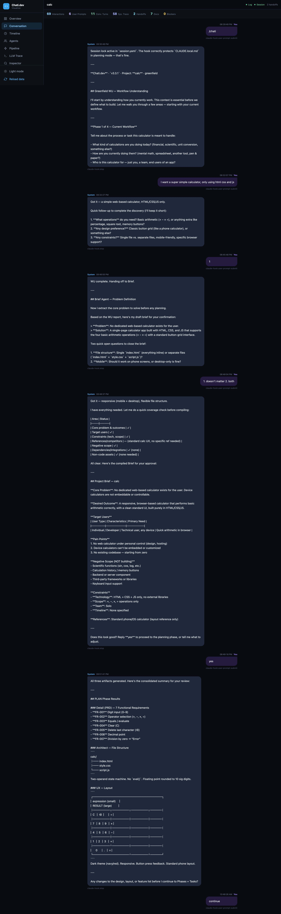
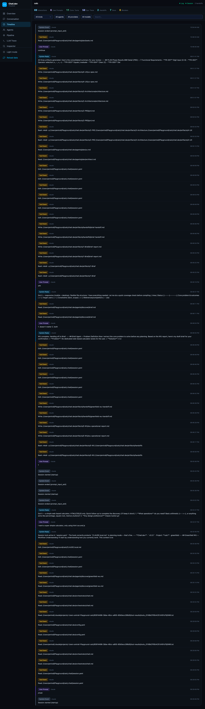
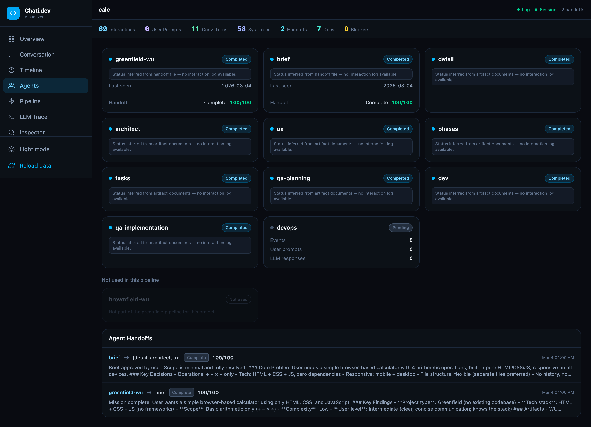
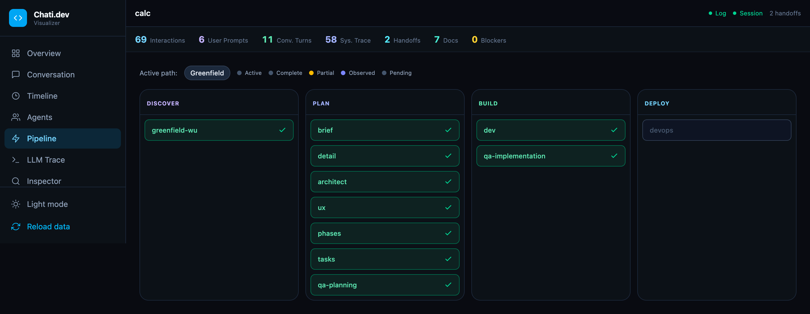
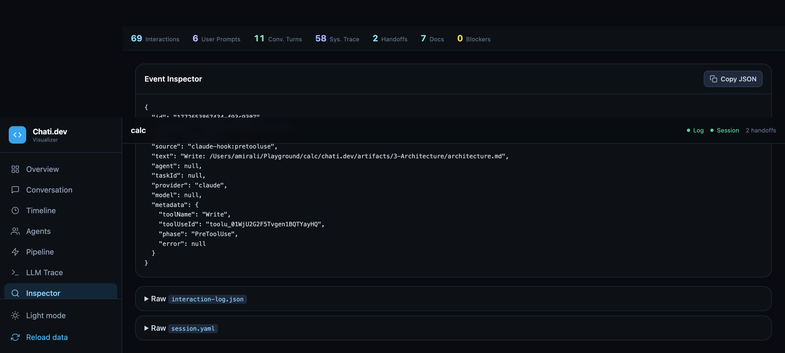

# chati-dev-visualizer

A real-time web dashboard for inspecting [chati.dev](https://chati.dev) pipeline runs. It reads your project's interaction log, session state, agent handoffs, and generated artifact documents, then presents them in a structured, human-readable UI.

## Features

- **Overview** — project summary, handoff cards, and an agent document pipeline timeline
- **Conversation** — the full user ↔ LLM dialogue with preserved formatting
- **Timeline** — every pipeline event in chronological order with kind, agent, and timestamp
- **Agents** — per-agent status board that incorporates interaction logs, handoff files, and artifact documents; agents not part of the active pipeline are clearly marked as not used
- **Pipeline** — visual flow of the active pipeline (Greenfield / Brownfield / Standard / Quick Flow) with per-node status indicators
- **LLM Trace** — raw LLM request/response pairs for debugging
- **Inspector** — click any event to view its full JSON payload
- **Handoff detail pages** — full rendered markdown for each agent handoff
- **Artifact document pages** — full rendered markdown for each generated document
- Dark and light theme support

## Screenshots

### Overview


### Conversation


### Timeline


### Agents


### Pipeline


### Inspector


## Usage

The visualizer is launched automatically by the chati.dev CLI:

```sh
$chati visualize
```

It reads data from your project directory via the `CHATI_PROJECT_DIR` environment variable. The following paths are scanned:

| Path | Contents |
|---|---|
| `.chati/interaction-log.json` | Full interaction log |
| `.chati/session.yaml` | Session state and agent statuses |
| `chati.dev/artifacts/handoffs/` | Agent handoff markdown files |
| `chati.dev/artifacts/<agent>/` | Artifact documents per agent |

If `chati.dev/artifacts` does not exist, the visualizer falls back to an `artifacts/` folder at the project root (useful for development with sample data).

## Development

```sh
# Install dependencies
npm install

# Start the dev server (defaults to port 4179)
npm run dev

# Point at a specific project directory
CHATI_PROJECT_DIR=/path/to/your/project npm run dev
```

## Building

```sh
npm run build
npm run preview
```
